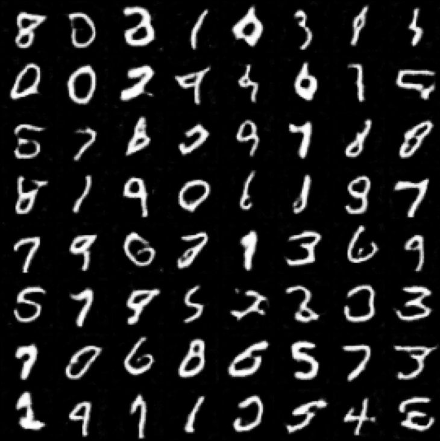

# DCGAN Experiment on MNIST

## Introduction

Generative Adversarial Networks (GANs) are a class of deep learning models introduced by Ian Goodfellow and et al in 2014.
GANs consist of two neural networks, a generator and a discriminator, that are trained simultaneously.
The generator learns to create realistic synthetic data, while the discriminator learns to distinguish between real and fake data.
The two networks are trained in a process that resembles a two-player adversarial game, where the generator attempts to produce more convincing data and the discriminator tries to get better at identifying fake data.

In a way the generator has a similar prupose to the decoder of a variational autoencoder (VAE):
It converts a normally distributed vector in latent space into a sample (i.e. an image) in the original data space.

The discriminator tackles a supervised learning problem, where the goal is to classify the input data as real or fake.

The generator uses the score the discriminator to images it generates as a loss function, which is backpropagated through the generator network.

It is important not to train the discriminator to simply get worse at discerning real from fake data - we want the generator to get better at generating realistic data, not just getting less good at distinguishing between real and fake data.

Deep Convolutional Generative Adversarial Networks (DCGANs) are a popular variation of GANs that use convolutional layers in both the generator and discriminator networks. DCGANs have demonstrated impressive results in generating high-quality synthetic images.

Here we use a DCGAN to generate synthetic handwritten digits using the MNIST dataset.
The MNIST dataset is a collection of 70,000 grayscale images of handwritten digits (0-9) with a resolution of 28x28 pixels.
The dataset is simple enough to locally train a DCGAN in a reasonable amount of time, while still being complex enough to produce interesting results.

## Method

In this experiment, we implement a DCGAN to generate synthetic handwritten digits using the MNIST dataset. Our approach consists of the following steps:

1. Load the MNIST dataset and apply the necessary preprocessing, including resizing the images, converting them to tensors, and normalizing the pixel values.
2. Define the generator and discriminator networks using PyTorch. The generator uses transposed convolutional layers, batch normalization, and ReLU activation functions, while the discriminator employs convolutional layers, batch normalization, and Leaky ReLU activation functions.
3. Set up the optimizers (Adam) and the binary cross-entropy loss function for training the generator and discriminator networks.
4. Train the generator and discriminator networks simultaneously for a fixed number of epochs. During each iteration, the generator creates fake images using random noise as input, and the discriminator is trained to classify real and fake images. The loss functions for both networks are updated accordingly.
5. Generate synthetic handwritten digits using the trained generator network and display them in a gallery format.

## Results

The results of our DCGAN experiment show that the model is capable of generating synthetic handwritten digits that resemble those in the MNIST dataset. The generated digits exhibit variation in styles and shapes, indicating that the generator has learned to capture the underlying distribution of the dataset.

However, some of the generated digits may not be perfect, as this implementation uses a simple architecture and a limited number of training epochs. To improve the quality of the generated digits, you can try training the model for more epochs or fine-tuning the hyperparameters.

On my MacBook Pro M1 with MPS support, the training took about 25 seconds per epoch.
I noticed that increasing batch size actually sped up training, a batch size of 64 actually took around 46 seconds per epoch.
The need to "max out the batch size" on M1 has been mentioned elswhere as well: [https://twitter.com/DrCMcMaster/status/1527117188603461633?s=20](https://twitter.com/DrCMcMaster/status/1527117188603461633?s=20).

Here are some examples of synthetic handwritten digits generated by our DCGAN model:

