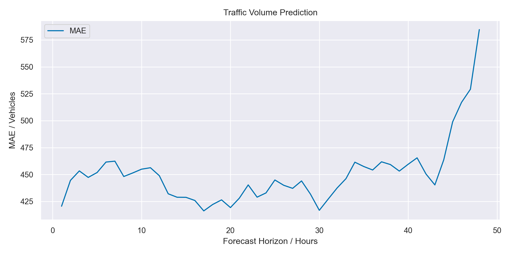
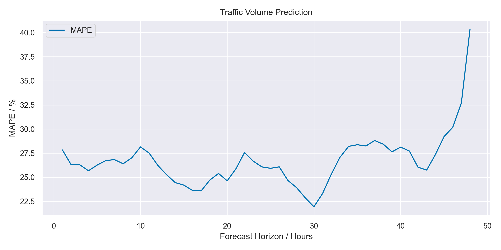

# Traffic Volume Prediction

This project aims to predict the traffic volume on a highway using a deep neural network (DNN). The data used in this project is [https://archive.ics.uci.edu/ml/datasets/Metro+Interstate+Traffic+Volume](https://archive.ics.uci.edu/ml/datasets/Metro+Interstate+Traffic+Volume).

## Download the data

Fetch the data from [https://archive.ics.uci.edu/ml/machine-learning-databases/00492/Metro_Interstate_Traffic_Volume.csv.gz](https://archive.ics.uci.edu/ml/machine-learning-databases/00492/Metro_Interstate_Traffic_Volume.csv.gz) and save it to your current directory. Unzip it there.

## Time Windowing
To predict the traffic volume, we use a time windowing approach where we split the data into windows of a fixed size and use the data in each window to predict the traffic volume in the next few hours. Specifically, we use a sliding window approach where we slide the window by a fixed amount and use the data in each window to predict the traffic volume in the next label_width hours.

## Time Encoding
In addition to the raw traffic volume data, we also use time encoding to help the DNN learn patterns in the data that are related to time. Specifically, we encode the day of year, day of week, and hour of day using cosine and sine functions. This allows the DNN to learn patterns in the data that are related to time, such as rush hour traffic or seasonal variations in traffic volume.

## DNN Architecture
The DNN used in this project consists of an input layer, two hidden layers, and an output layer. The input layer takes in the data in each window and passes it through a fully connected layer with ReLU activation functions.

## Early Stopping
Early stopping is used to prevent overfitting. Specifically, the training is stopped when the validation loss stops decreasing for a certain number of epochs. In our current experiments, early stopping kicks in at around 65 epochs.

## Results
The mean absolute error (MAE) is used as the evaluation metric for this project. The MAE is calculated as the average absolute difference between the predicted traffic volume and the true traffic volume over all forecast horizons. The MAE is reported in vehicles and increases as the forecast horizon gets larger.

The plot shows the MAE per forecast horizon for the test set. As can be seen from the plot, the MAE increases as the forecast horizon gets larger, indicating that it is more difficult to predict the traffic volume further into the future.

Here is the mean absolute percentage error (MAPE) for the test set:

