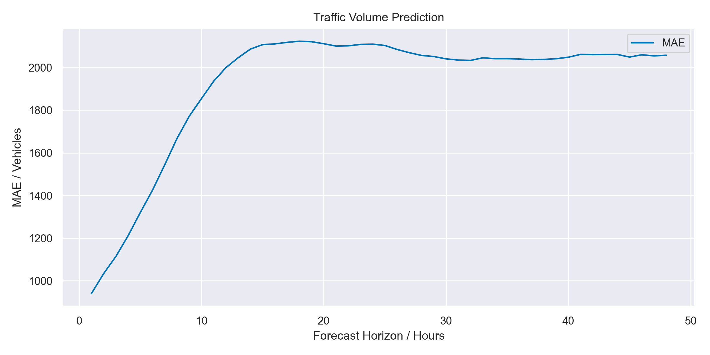
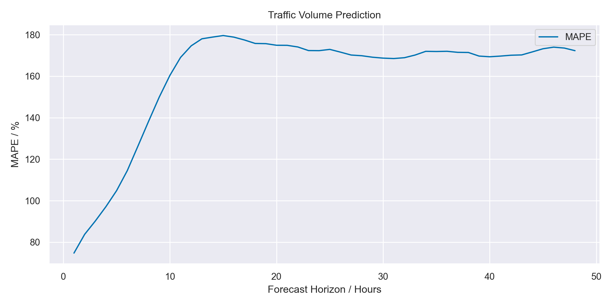

# Traffic Volume Prediction

This project aims to predict the traffic volume on a highway using an autoencoder / seq2seq based on LSTM layers. The data used in this project is [https://archive.ics.uci.edu/ml/datasets/Metro+Interstate+Traffic+Volume](https://archive.ics.uci.edu/ml/datasets/Metro+Interstate+Traffic+Volume).

## Download the data

Fetch the data from [https://archive.ics.uci.edu/ml/machine-learning-databases/00492/Metro_Interstate_Traffic_Volume.csv.gz](https://archive.ics.uci.edu/ml/machine-learning-databases/00492/Metro_Interstate_Traffic_Volume.csv.gz) and save it to your current directory. Unzip it there.

## Time Windowing
To predict the traffic volume, we use a time windowing approach where we split the data into windows of a fixed size and use the data in each window to predict the traffic volume in the next few hours. Specifically, we use a sliding window approach where we slide the window by a fixed amount and use the data in each window to predict the traffic volume in the next label_width hours.

## Time Encoding
In addition to the raw traffic volume data, we also use time encoding to help the DNN learn patterns in the data that are related to time. Specifically, we encode the day of year, day of week, and hour of day using cosine and sine functions. This allows the DNN to learn patterns in the data that are related to time, such as rush hour traffic or seasonal variations in traffic volume.

## Model Architecture
The TrafficPredictor class defines the architecture of the sequence-to-sequence model. It inherits from PyTorch's nn.Module. The model has an encoder LSTM, a decoder LSTM, and an output layer. The forward method defines how the input data is processed by the model. If target data is provided (during training), the model uses teacher forcing, where the true output at each step is provided as input to the decoder at the next step. If no target data is provided (during inference), the model feeds its own output from the previous step as input to the decoder.

## Early Stopping
Early stopping is used to prevent overfitting. Specifically, the training is stopped when the validation loss stops decreasing for a certain number of epochs. Our code memorizes the best model parameters and restores them when training is complete.

## Results
The mean absolute error (MAE) is used as the evaluation metric for this project. The MAE is calculated as the average absolute difference between the predicted traffic volume and the true traffic volume over all forecast horizons. The MAE is reported in vehicles and increases as the forecast horizon gets larger.

Presently, the model performs poorly and I need to investigate further to determine why.

The MAE in vehicles per forecast horizon for the test set is shown below:

Here is the mean absolute percentage error (MAPE) for the test set:

